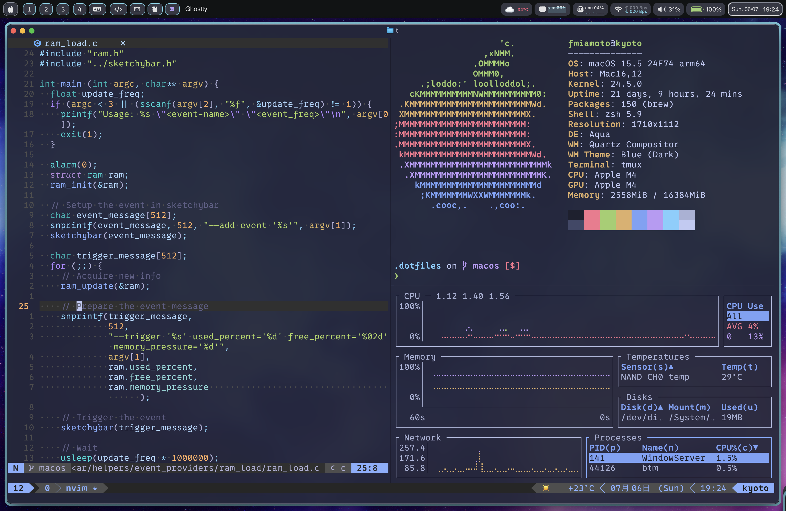

# dotfiles

This repository contains my configuration files - a.k.a dotfiles - that I change probably more than I should.

It also contains some helper recipes for bootstrapping an Arch-based environment with 
my most used packages. Thus, you can run the provided recipes on a fresh Arch installation 
and get an environment similar to mine. 

Take a look at the Makefile for more details.

- Distro: Arch Linux
- WM: [dwm](https://github.com/fsmiamoto/dwm)
- Notifications: dunst
- Shell: zsh
- Prompt: [Benri](https://github.com/fsmiamoto/benri)
- Terminal Emulator: [st](https://github.com/fsmiamoto/st)
- File manager: lf
- Editor: Neovim

Colorscheme generated with PyWal

### Installing

```sh
    # Clone the repo
    $ git clone git@github.com/fsmiamoto/dotfiles ~/.dotfiles
    $ cd ~/.dotfiles

    # Installs packages and dotfiles 
    $ make

    # You can also run the steps separately
    $ make install
    $ make packages
    $ make yay

    # Install packages for graphical environment
    $ make xorg
```


