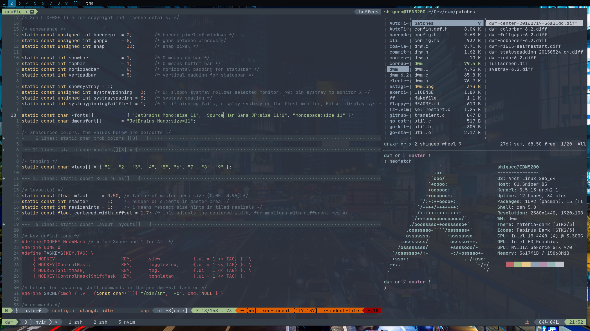

# dotfiles

This repo contains my config files, a.k.a dotfiles, that I change probably more than I should.

###

- Distro: Arch Linux
- WM: i3-gaps
- Status bar: Polybar
- Notifications: dunst
- Shell: zsh
- Terminal Emulator: st
- File manager: ranger
- Editor: NeoVim

Colorscheme generated with PyWal

### Installing

```bash
    # Installs dotfiles with backup of current ones in $HOME/.dotfiles.backup
    $ make

    # You can also run the steps separately
    $ make backup
    $ make install
```

### Screenshots



### Todo's

- Add command to make file to restore backed up files
